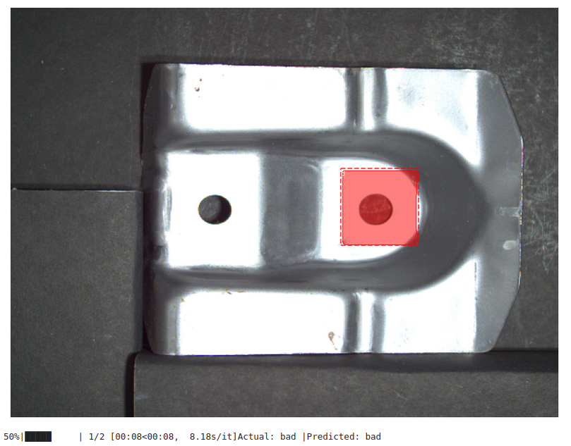
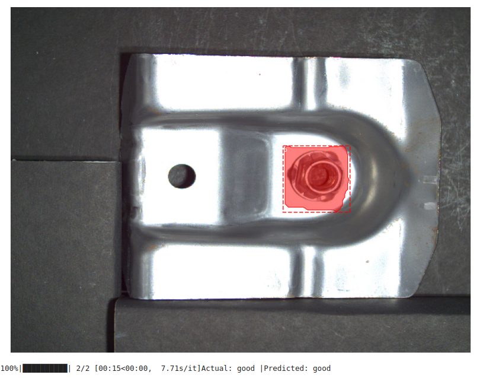

<h1>Flaw-detection-in-steel-objects</h1>

The project aims at predicting defects in hard steel isntruments using state of the art Mask RCNN algorithm.

 
<h1>Prediction Results</h1>
 

  

    
    

  <figure style="text-align: center;">
    
    <figcaption>Figure 2. Image with No Defect</figcaption>
  </figure>
  
  

  
  

    
  <figure style="text-align: center;">
    
    <figcaption>Figure 2. Image with Defect in Instrument</figcaption>
  </figure>
  

 
